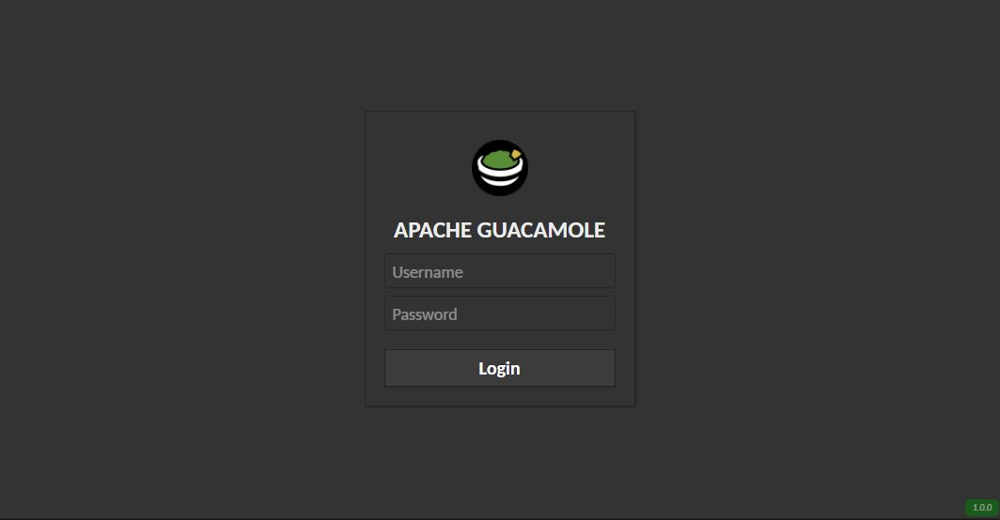

# dark-guacamole
:lipstick: A dark theme for [Apache Guacamole](https://guacamole.apache.org/).

## Usage
First you need to map to volume the `/opt/guacamole` for guacamole container
```
volumes:
  guac_www:
    driver: local
    driver_opts:
      type: none
      o: bind
      device: /opt/guacamole/www

services:
  guacamole:
      image: guacamole/guacamole:latest
      container_name: guacamole
      hostname: guacamole
      restart: unless-stopped
      volumes:
        - guac_www:/opt/guacamole
       ... rest of your code
```
Next step is to create `customcss.css` file inside of this within folder `extracted`
- i did it on host, as there is no nano in docker ( you can install it with apt update && apt install nano )
- on host where is the volume location, in my case `/opt/guacamole/www` run `mkdir extracted`
- then nano `customcss.css` and copy there the customcss from repo, or just download it there

Next we open shell to container as root:
```
docker exec -it -u root guacamole bash
cd extracted
# decompress existing guacamole.war from the container to extracted folder
jar -xvf ../guacamole.war
# add the customcss.css stylesheet before body to all html files
find . -type f -name "*.html" -exec sed -i '/<link rel="stylesheet" href="1.guacamole.*\.css"><link rel="stylesheet" href="app\.css\?.*">/s|</head>|<link rel="stylesheet" href="customcss.css"></head>|' {} \;
```
Last step is to compress content of `extracted` to the `guacamole.war`
- this is needed everytime you change the customcss.css
- i was not able to map the custom css directly in `/home/guacamole/tomcat/webapps/guacamole/` as it always fail to start the container after.
```
docker exec -it -u root guacamole bash
cd extracted && jar -cvf ../guacamole.war *
exit
docker restart guacamole
```

### Here's how it looks like



## Contribution
This CSS was created by madmath03 [Original CSS]([https://github.com/madmath03/dark-guacamole/pulls](https://github.com/madmath03/dark-guacamole)) are also welcome.

## License 
This theme is released under the [**MIT**](/LICENSE) license.
